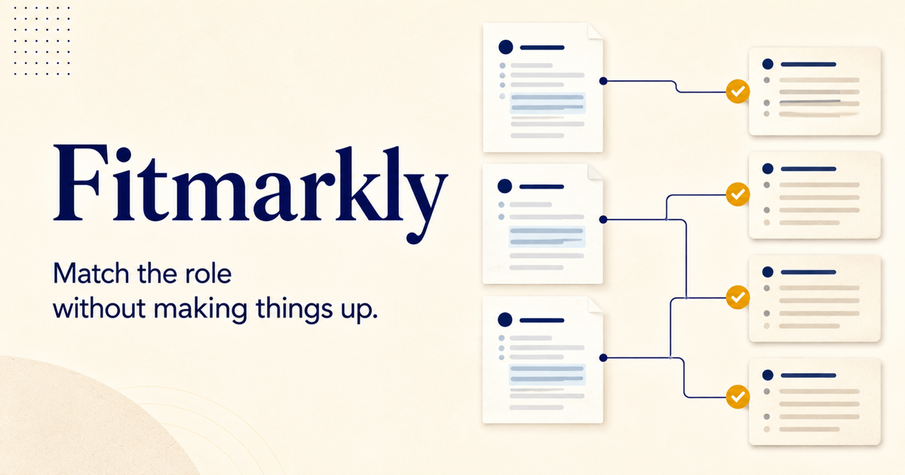

# Fitmarkly

Match a resume to a role without inventing experience.

Fitmarkly is a local-first, evidence-based resume review workspace. It maps job requirements to exact resume sentences, labels the strength of each match, protects user-defined facts, and proposes only narrow wording changes that the user can accept or dismiss.



## What works today

- Editable resume and job description workspace
- Local `.txt` and `.md` resume import
- Deterministic supported / partial / missing requirement mapping
- Exact evidence and matched-term inspection
- Claim locks for facts that must not change
- Accept-or-dismiss wording suggestions
- Browser-local persistence with no account required
- Resume text and JSON review-ledger export
- Responsive, keyboard-friendly interface

The current analyzer is deliberately deterministic and runs in the browser. It does not predict hiring outcomes, fabricate accomplishments, or upload resume text to a server. PDF/DOCX parsing and optional model-provider adapters are future work.

## Run locally

Requires Node.js 22.13 or newer.

```bash
npm install
npm run dev
```

Open `http://localhost:3000`.

## Quality checks

```bash
npm run check
npm audit
```

## Architecture

- React 19 + TypeScript
- Tailwind CSS and shadcn components
- Vinext/Vite with Cloudflare Workers output
- Pure domain functions in `lib/domain.ts`, tested with Vitest
- `localStorage` for workspace persistence

## Privacy and safety

Resume and job-description text remain in the current browser in this release. Treat exported ledgers as sensitive personal data. Fitmarkly is an independent project and is not affiliated with Jobscan or any employer, recruiting platform, or applicant-tracking system.

## License

MIT
